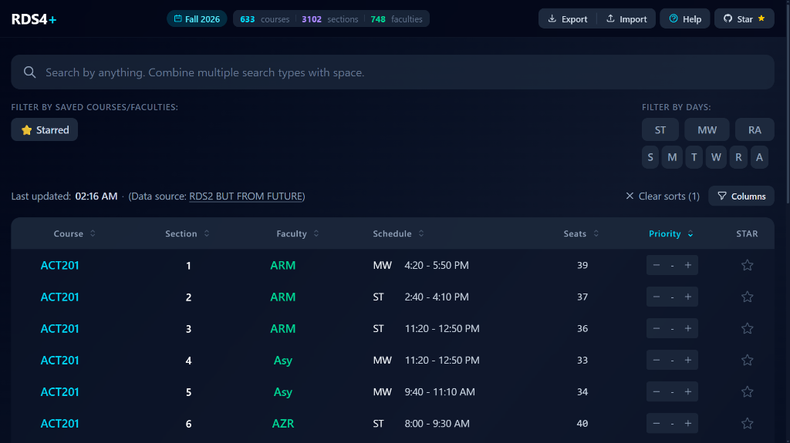

# RDS4+

**A fast, clean course advising planning assistant for North South University (NSU) students.**

**Live App**: [rds4plus.vercel.app](https://rds4plus.vercel.app)

## Overview

RDS4+ is designed to help preplan course advising. It allows NSU students to save and rank preferred sections and faculties before their course registration slot opens.

[](https://rds4plus.vercel.app)

Built with Next.js 16 (Turbopack) and React 19, RDS4+ delivers immediate search and filtering across 3,000+ course sections with zero client-side lag, intelligent multi-term queries, dynamic priority ranking indicators, automated direct sync from the official NSU RDS4 system, and seamless JSON configuration backup and migration.

## Table of Contents

- [Overview](#overview)
- [Features](#features)
- [Tech Stack](#tech-stack)
- [Getting Started](#getting-started)
- [Project Structure](#project-structure)
- [Acknowledgements](#acknowledgements)
- [License](#license)

## Features

### 1. Direct Automated Sync from NSU RDS4
* Course schedule data is scraped and synced directly from the official NSU RDS4 portal automatically.
* In-app refresh button updates course data without needing a full page reload.
* Background change detector notifies students if new data becomes available while planning.

### 2. Priority Ranking (-9 to 99)
* Rank sections for your pre-advised courses using step controls.
* Visual relative indicators highlight top-choice sections dynamically:
  * **Cyan / Teal**: Highest priority sections to target first.
  * **Yellow / Orange / Red**: Lower priority backup sections.
* Quickly determine which backup section to register for if your primary choice fills up.
* Dedicated **Clear all priorities** button (with safety confirmation dialog) appears when multiple priorities are set.

### 3. Smart Multi-Term Search & Keyboard Shortcuts
* Search simultaneously by course code, faculty initials, days, and times using plain space-separated keywords.
* Press `/` or `Ctrl+K` (`Cmd+K` on Mac) anywhere on the page to immediately focus the search bar.
* Example queries:
  * `cse115 rjp st` — finds CSE115 with faculty RJP on Sunday/Tuesday.
  * `mat120 9:40` — matches MAT120 sections starting at 9:40 AM.
  * `eng102 mw 11:20` — matches specific course, slot, and time combinations directly.

### 4. Pin and Quick Filters
* Save courses and preferred faculties with one click to generate quick-toggle filter pills above the table.
* Combine saved pills with active searches for focused views.

### 5. Star Favorite Sections
* Star specific sections across multiple courses to construct your target routine.
* Toggle the **Starred** filter pill to restrict the view exclusively to your shortlist.

### 6. Day and Routine Filters
* Filter by standard NSU schedule slots:
  * **ST** (Sunday / Tuesday)
  * **MW** (Monday / Wednesday)
  * **RA** (Thursday / Saturday)
* Filter by individual days (**S**, **M**, **T**, **W**, **R**, **A**) to plan clash-free schedules.

### 7. Customizable Columns and Multi-Column Sorting
* Use the **Columns** dropdown above the table to toggle column visibility (`Course`, `Faculty`, `Seats`, `Section`, `Schedule`, `Priority`, `Star`, `#`).
* Multi-column sorting support with clean precedence indicators; clear sorts button appears when multiple sorts are active.

### 8. Smooth Light & Dark Themes
* Full dark mode and high-contrast light mode with system preference auto-detection.
* Interactive theme toggle featuring a circular wave ripple transition (powered by the native View Transitions API).

### 9. Export and Import Setup
* Save your entire setup—including filters, priorities, and starred sections—to a portable JSON file.
* Load it back at any time or transfer it to another device before advising begins.

## Tech Stack

* **Framework**: Next.js 16 (App Router + Turbopack)
* **Library**: React 19
* **Language**: TypeScript
* **Styling**: Tailwind CSS v4 (borderless dark & light interface)
* **State & Persistence**: Browser `localStorage` with JSON backup/restore
* **Deployment**: Vercel

## Getting Started

### Prerequisites

* Node.js (v18.17.0 or higher)
* npm, pnpm, or yarn

### Installation

1. Clone the repository:

   ```bash
   git clone https://github.com/Aminul-Islam7/rds4plus.git
   cd rds4plus
   ```
2. Install dependencies:

   ```bash
   npm install
   ```
3. Run the development server:

   ```bash
   npm run dev
   ```
4. Open [http://localhost:3000](http://localhost:3000) in your browser.

### Production Build

```bash
npm run build
npm run start
```

## Project Structure

```text
rds4plus/
├── app/
│   ├── api/
│   │   └── courses/
│   │       └── route.ts              # Course dataset API route and caching
│   ├── components/
│   │   ├── ClearPrioritiesModal.tsx  # Confirmation modal for clearing ranks
│   │   ├── CourseTable.tsx           # Table, search, column toggles, and filters
│   │   ├── ExportImportButtons.tsx   # JSON data backup and migration controls
│   │   ├── HelpModal.tsx             # Advising guide and usage walkthrough
│   │   ├── OnlineVisitors.tsx        # Live peer count badge
│   │   ├── ThemeToggle.tsx           # Animated light/dark wave toggle
│   │   └── UpdateNotification.tsx    # Background dataset change alert
│   ├── context/
│   │   ├── CourseContext.tsx         # Course data fetching context
│   │   └── ThemeContext.tsx          # Light/dark theme provider
│   ├── hooks/
│   │   └── useTableState.ts          # Filter, sort, star, and priority state logic
│   ├── lib/
│   │   └── parser.ts                 # Timing parser and schedule utilities
│   ├── types/
│   │   └── course.ts                 # Data models and interfaces
│   ├── globals.css                   # Global styles and view transition rules
│   ├── layout.tsx                    # Root application layout
│   └── page.tsx                      # Header, status stats, and main layout
├── data/
│   ├── courses.json                  # Parsed course schedule dataset
│   ├── last_updated.json             # Sync timestamp metadata
│   └── response.json                 # Raw scraped RDS4 data
├── scripts/
│   ├── scrape_rds4.mjs               # Direct NSU RDS4 scraper script
│   └── sync_rds4.mjs                 # Automation sync & dataset builder
├── public/
│   └── screenshot.png                # Interface preview image
├── LICENSE                           # MIT License file
├── package.json
└── tsconfig.json
```

## Acknowledgements

* **[Maharun Afroz](https://github.com/maharun0/course-koi)**: Creator of [Course Koi?](https://course-koi.vercel.app/). RDS4+ was inspired by Course Koi?, built with a focus on faster load times, multi-term search parsing, and a simpler user interface.
* Course data is automatically synced directly from the official NSU RDS4 portal (early versions previously fetched from rds2-bff).
* Created and maintained by [Aminul Islam](https://github.com/Aminul-Islam7) ([LinkedIn](https://www.linkedin.com/in/aminul-islam7/)).

## License

This project is open-source and free to use for all students. Distributed under the [MIT License](LICENSE).
